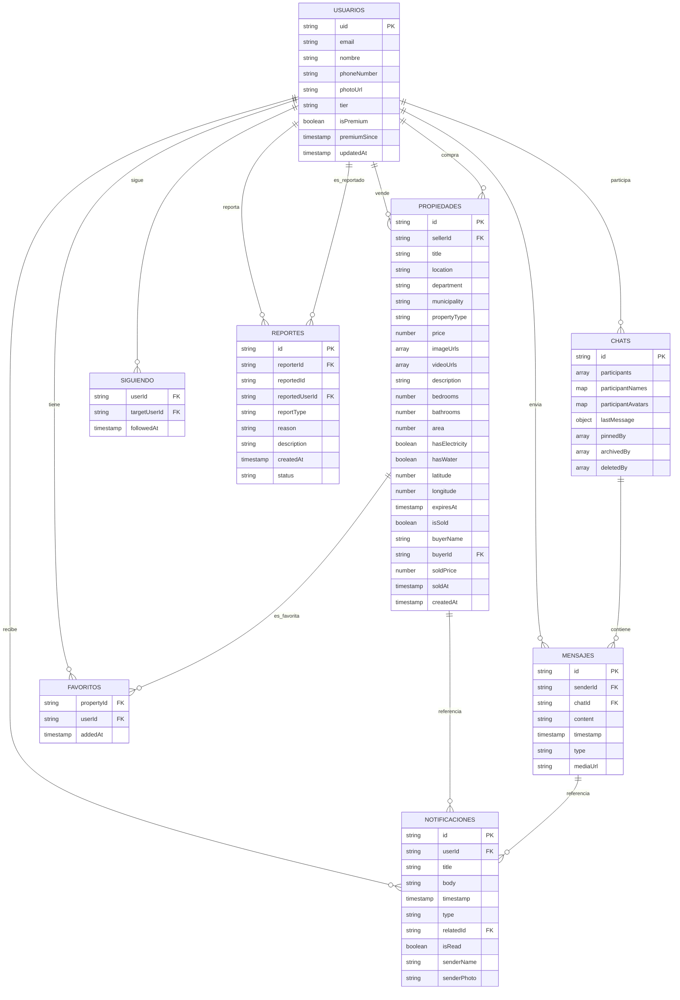

# Diagrama Entidad-Relación Actualizado (2026-06-05)



## Tabla Comparativa: Antes vs Después

| Entidad | Cambio | Detalles |
|---------|--------|---------|
| **PROPIEDADES** | 🟢 EXPANDIDO | +17 campos nuevos (detalles, multimedia, geolocalización, venta) |
| **USUARIOS** | 🟡 FALTA MODELO | Solo existe SessionUser (uid, email, displayName, phoneNumber) |
| **NOTIFICACIONES** | 🟢 MEJORADO | +3 campos (isRead, senderName, senderPhoto) |
| **MENSAJES** | 🟢 MEJORADO | +2 campos (type para multimedia, mediaUrl) |
| **CHATS** | 🟢 MEJORADO | +4 campos (lastMessage embedded, pinnedBy, archivedBy, deletedBy) |
| **FAVORITOS** | 🟢 NORMALIZADO | Estructura confirmada como subcollection |
| **SIGUIENDO** | 🟢 CONFIRMADO | Estructura de subcollection validada |
| **REPORTES** | 🟢 MEJORADO | +2 campos (reason, status) |
| **SUBSCRIPTIONS** | 🆕 NUEVO | Almacenado en USUARIOS (tier, isPremium, premiumSince) |
| **PAYMENTS** | 🔴 EXTERNO | Gestionado por RevenueCat (no en Firestore) |

## Relaciones Principales

```
USUARIOS (uid) ──────┐
                    ├─→ PROPIEDADES (como sellerId)
                    ├─→ PROPIEDADES (como buyerId)
                    ├─→ CHATS (participante)
                    ├─→ MENSAJES (senderId)
                    ├─→ NOTIFICACIONES (userId)
                    ├─→ FAVORITOS (userId) → PROPIEDADES
                    ├─→ SIGUIENDO (userId) → USUARIOS (targetUserId)
                    └─→ REPORTES (reporterId/reportedUserId)

CHATS (id) ──────────→ MENSAJES
          └─────────→ USUARIOS (participants)

PROPIEDADES (id) ────→ NOTIFICACIONES (relatedId)
             └──────→ FAVORITOS
```

## Cambios Críticos por Impacto

### 🔴 Alto Impacto
1. **USUARIOS sin modelo completo** - La mayoría de operaciones dependen de este modelo
2. **Nuevos campos en PROPIEDADES** - Requieren actualización de Firestore rules

### 🟡 Medio Impacto
1. **Campo relatedId en NOTIFICACIONES** - Requiere validación de FK en rules
2. **Embedded lastMessage en CHATS** - Potencial sincronización duplicada

### 🟢 Bajo Impacto
1. **type en MENSAJES** - Cambio compatible hacia atrás
2. **SUBSCRIPTIONS en USUARIOS** - Datos adicionales sin conflicto

## Próximas Acciones

1. ✅ Leer modelos existentes
2. ✅ Comparar con diagrama anterior
3. ⏳ **Crear modelo completo USUARIOS**
4. ⏳ Validar Firestore rules con nueva estructura
5. ⏳ Crear índices necesarios
6. ⏳ Documentar campos de auditoría (createdAt, updatedAt)
7. ⏳ Revisar campos redundantes (isFavorite en PROPIEDADES)
