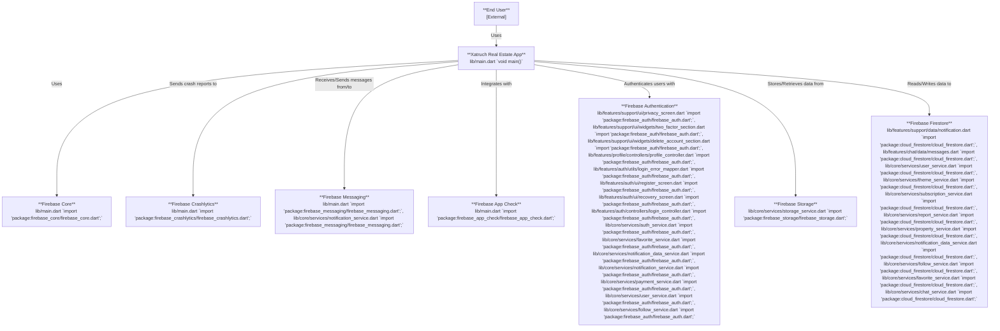

# Unnamed CodeViz Diagram

```mermaid
graph TD

    base.cv::xatruch_app["**Xatruch Real Estate App**<br>lib/main.dart `void main()`"]
    base.cv::firebase_core["**Firebase Core**<br>lib/main.dart `import 'package:firebase_core/firebase_core.dart';`"]
    base.cv::firebase_crashlytics["**Firebase Crashlytics**<br>lib/main.dart `import 'package:firebase_crashlytics/firebase_crashlytics.dart';`"]
    base.cv::firebase_messaging["**Firebase Messaging**<br>lib/main.dart `import 'package:firebase_messaging/firebase_messaging.dart';`, lib/core/services/notification_service.dart `import 'package:firebase_messaging/firebase_messaging.dart';`"]
    base.cv::firebase_app_check["**Firebase App Check**<br>lib/main.dart `import 'package:firebase_app_check/firebase_app_check.dart';`"]
    base.cv::firebase_auth["**Firebase Authentication**<br>lib/features/support/ui/privacy_screen.dart `import 'package:firebase_auth/firebase_auth.dart';`, lib/features/support/ui/widgets/two_factor_section.dart `import 'package:firebase_auth/firebase_auth.dart';`, lib/features/support/ui/widgets/delete_account_section.dart `import 'package:firebase_auth/firebase_auth.dart';`, lib/features/profile/controllers/profile_controller.dart `import 'package:firebase_auth/firebase_auth.dart';`, lib/features/auth/utils/login_error_mapper.dart `import 'package:firebase_auth/firebase_auth.dart';`, lib/features/auth/ui/register_screen.dart `import 'package:firebase_auth/firebase_auth.dart';`, lib/features/auth/ui/recovery_screen.dart `import 'package:firebase_auth/firebase_auth.dart';`, lib/features/auth/controllers/login_controller.dart `import 'package:firebase_auth/firebase_auth.dart';`, lib/core/services/auth_service.dart `import 'package:firebase_auth/firebase_auth.dart';`, lib/core/services/favorite_service.dart `import 'package:firebase_auth/firebase_auth.dart';`, lib/core/services/notification_data_service.dart `import 'package:firebase_auth/firebase_auth.dart';`, lib/core/services/notification_service.dart `import 'package:firebase_auth/firebase_auth.dart';`, lib/core/services/payment_service.dart `import 'package:firebase_auth/firebase_auth.dart';`, lib/core/services/user_service.dart `import 'package:firebase_auth/firebase_auth.dart';`, lib/core/services/follow_service.dart `import 'package:firebase_auth/firebase_auth.dart';`"]
    base.cv::firebase_storage["**Firebase Storage**<br>lib/core/services/storage_service.dart `import 'package:firebase_storage/firebase_storage.dart';`"]
    base.cv::firebase_firestore["**Firebase Firestore**<br>lib/features/support/data/notification.dart `import 'package:cloud_firestore/cloud_firestore.dart';`, lib/features/chat/data/messages.dart `import 'package:cloud_firestore/cloud_firestore.dart';`, lib/core/services/user_service.dart `import 'package:cloud_firestore/cloud_firestore.dart';`, lib/core/services/theme_service.dart `import 'package:cloud_firestore/cloud_firestore.dart';`, lib/core/services/subscription_service.dart `import 'package:cloud_firestore/cloud_firestore.dart';`, lib/core/services/report_service.dart `import 'package:cloud_firestore/cloud_firestore.dart';`, lib/core/services/property_service.dart `import 'package:cloud_firestore/cloud_firestore.dart';`, lib/core/services/notification_data_service.dart `import 'package:cloud_firestore/cloud_firestore.dart';`, lib/core/services/follow_service.dart `import 'package:cloud_firestore/cloud_firestore.dart';`, lib/core/services/favorite_service.dart `import 'package:cloud_firestore/cloud_firestore.dart';`, lib/core/services/chat_service.dart `import 'package:cloud_firestore/cloud_firestore.dart';`"]
    base.cv::user["**End User**<br>[External]"]
    %% Edges at this level (grouped by source)
    base.cv::user["**End User**<br>[External]"] -->|"Uses"| base.cv::xatruch_app["**Xatruch Real Estate App**<br>lib/main.dart `void main()`"]
    base.cv::xatruch_app["**Xatruch Real Estate App**<br>lib/main.dart `void main()`"] -->|"Uses"| base.cv::firebase_core["**Firebase Core**<br>lib/main.dart `import 'package:firebase_core/firebase_core.dart';`"]
    base.cv::xatruch_app["**Xatruch Real Estate App**<br>lib/main.dart `void main()`"] -->|"Sends crash reports to"| base.cv::firebase_crashlytics["**Firebase Crashlytics**<br>lib/main.dart `import 'package:firebase_crashlytics/firebase_crashlytics.dart';`"]
    base.cv::xatruch_app["**Xatruch Real Estate App**<br>lib/main.dart `void main()`"] -->|"Receives/Sends messages from/to"| base.cv::firebase_messaging["**Firebase Messaging**<br>lib/main.dart `import 'package:firebase_messaging/firebase_messaging.dart';`, lib/core/services/notification_service.dart `import 'package:firebase_messaging/firebase_messaging.dart';`"]
    base.cv::xatruch_app["**Xatruch Real Estate App**<br>lib/main.dart `void main()`"] -->|"Integrates with"| base.cv::firebase_app_check["**Firebase App Check**<br>lib/main.dart `import 'package:firebase_app_check/firebase_app_check.dart';`"]
    base.cv::xatruch_app["**Xatruch Real Estate App**<br>lib/main.dart `void main()`"] -->|"Authenticates users with"| base.cv::firebase_auth["**Firebase Authentication**<br>lib/features/support/ui/privacy_screen.dart `import 'package:firebase_auth/firebase_auth.dart';`, lib/features/support/ui/widgets/two_factor_section.dart `import 'package:firebase_auth/firebase_auth.dart';`, lib/features/support/ui/widgets/delete_account_section.dart `import 'package:firebase_auth/firebase_auth.dart';`, lib/features/profile/controllers/profile_controller.dart `import 'package:firebase_auth/firebase_auth.dart';`, lib/features/auth/utils/login_error_mapper.dart `import 'package:firebase_auth/firebase_auth.dart';`, lib/features/auth/ui/register_screen.dart `import 'package:firebase_auth/firebase_auth.dart';`, lib/features/auth/ui/recovery_screen.dart `import 'package:firebase_auth/firebase_auth.dart';`, lib/features/auth/controllers/login_controller.dart `import 'package:firebase_auth/firebase_auth.dart';`, lib/core/services/auth_service.dart `import 'package:firebase_auth/firebase_auth.dart';`, lib/core/services/favorite_service.dart `import 'package:firebase_auth/firebase_auth.dart';`, lib/core/services/notification_data_service.dart `import 'package:firebase_auth/firebase_auth.dart';`, lib/core/services/notification_service.dart `import 'package:firebase_auth/firebase_auth.dart';`, lib/core/services/payment_service.dart `import 'package:firebase_auth/firebase_auth.dart';`, lib/core/services/user_service.dart `import 'package:firebase_auth/firebase_auth.dart';`, lib/core/services/follow_service.dart `import 'package:firebase_auth/firebase_auth.dart';`"]
    base.cv::xatruch_app["**Xatruch Real Estate App**<br>lib/main.dart `void main()`"] -->|"Stores/Retrieves data from"| base.cv::firebase_storage["**Firebase Storage**<br>lib/core/services/storage_service.dart `import 'package:firebase_storage/firebase_storage.dart';`"]
    base.cv::xatruch_app["**Xatruch Real Estate App**<br>lib/main.dart `void main()`"] -->|"Reads/Writes data to"| base.cv::firebase_firestore["**Firebase Firestore**<br>lib/features/support/data/notification.dart `import 'package:cloud_firestore/cloud_firestore.dart';`, lib/features/chat/data/messages.dart `import 'package:cloud_firestore/cloud_firestore.dart';`, lib/core/services/user_service.dart `import 'package:cloud_firestore/cloud_firestore.dart';`, lib/core/services/theme_service.dart `import 'package:cloud_firestore/cloud_firestore.dart';`, lib/core/services/subscription_service.dart `import 'package:cloud_firestore/cloud_firestore.dart';`, lib/core/services/report_service.dart `import 'package:cloud_firestore/cloud_firestore.dart';`, lib/core/services/property_service.dart `import 'package:cloud_firestore/cloud_firestore.dart';`, lib/core/services/notification_data_service.dart `import 'package:cloud_firestore/cloud_firestore.dart';`, lib/core/services/follow_service.dart `import 'package:cloud_firestore/cloud_firestore.dart';`, lib/core/services/favorite_service.dart `import 'package:cloud_firestore/cloud_firestore.dart';`, lib/core/services/chat_service.dart `import 'package:cloud_firestore/cloud_firestore.dart';`"]

```
---
*Generated by [CodeViz.ai](https://codeviz.ai) on 5/21/2026, 4:51:12 PM*
