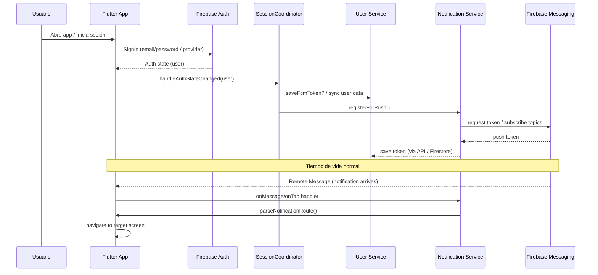

# Arquitectura del sistema

Este documento contiene tres diagramas Mermaid que describen la arquitectura y los flujos principales de la aplicación.

---

## 1) Module-Oriented (Arquitectura por módulos)

Descripción: Muestra la organización de carpetas/módulos (`core`, `features`, `data`, `components`) y las integraciones principales.

```mermaid
flowchart LR
  subgraph App["Flutter App"]
    direction TB
    UI[UI Layer\ncomponents/ & features/] --> Core[core/ (services, session, theme)]
    Core --> Data[data/ (repositories, models)]
    UI --> Data
  end

  subgraph Integrations["Servicios externos"]
    direction TB
    Firebase[FIREBASE\nAuth · Firestore · Storage] 
    Notifications[Firebase Messaging\nLocal Notifications]
    RevenueCat[RevenueCat / Purchases]
    Maps[Google Maps · Geolocator]
    Crashlytics[Crashlytics]
    AppCheck[Firebase App Check]
  end

  App --> Firebase
  App --> Notifications
  App --> RevenueCat
  App --> Maps
  App --> Crashlytics
  App --> AppCheck

  Core -->|uses| Firebase
  Core -->|uses| Notifications
  Core -->|uses| RevenueCat
  Data -->|persists| Firebase
  UI -->|navigation| Core
```

---

## 2) Auth & Notifications Flow (Flujo de autenticación y notificaciones)

Descripción: Secuencia típica desde login hasta registro de token FCM y manejo de taps en notificación.



---

## 3) Technical Architecture (Para README / Documentación técnica)

Descripción: Vista técnica con repositorios, Cloud Functions, y servicios backend.

```mermaid
flowchart TD
  Mobile[Mobile App (Flutter)]
  Mobile -->|Auth, DB, Storage| FirebaseAuth[Firebase Auth]
  Mobile -->|Reads/Writes| Firestore[Cloud Firestore]
  Mobile -->|Uploads| Storage[Firebase Storage]
  Mobile -->|Push| FCM[Firebase Messaging]
  Mobile -->|Crash/Logs| Crashlytics[Crashlytics]
  Mobile -->|App attestation| AppCheck[Firebase App Check]
  Mobile -->|Purchases| RevenueCat[RevenueCat / Purchases SDK]
  Mobile -->|Maps| GoogleMaps[Google Maps / Geolocator]

  subgraph Backend["Optional / Server-side"]
    CloudFunctions[Cloud Functions\nfunctions/index.js]
    CloudFunctions --> Firestore
    CloudFunctions --> Storage
  end

  Firestore --> Data[(Propiedades, Usuarios, Metadatos)]
  Storage --> Media[(Fotos / Videos)]
  FCM --> Mobile
  RevenueCat -->|Webhooks| CloudFunctions

  note right of Mobile: Proyecto organiza en `lib/core`, `lib/features`, `lib/data`
```

---

Si deseas que exporte estas vistas a imágenes (SVG/PNG) o que las añada directamente al `README.md`, dime cuál prefieres y procedo a generarlas o a insertar los bloques en `README.md`.
